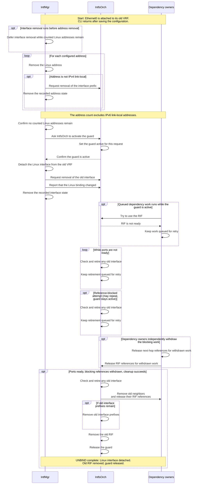
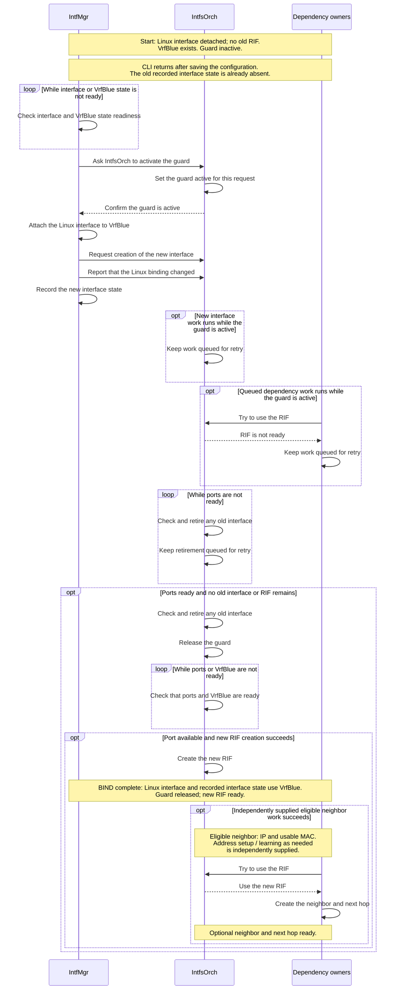
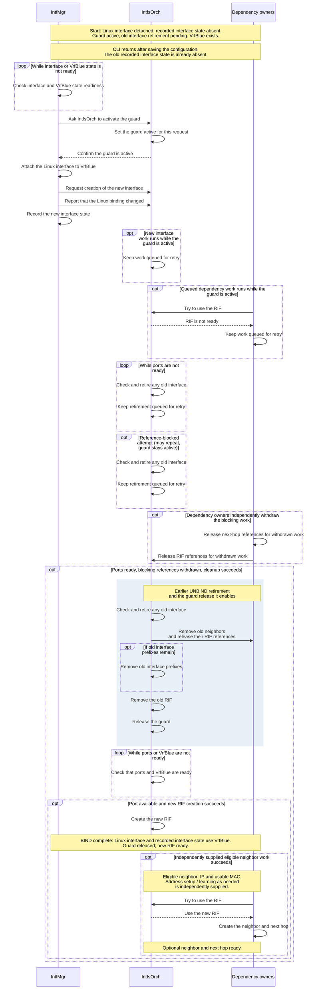

# SONiC VRF bind guard

## Revision history

| Rev | Date       | Author     | Change Description |
| --- | ---------- | ---------- | ------------------ |
| 0.1 | 2026-09-28 | Bojun-Feng | Initial draft. Describes the VRF bind guard and interface retirement approach. |

## Purpose

IntfMgr can change an interface's Linux binding—its attachment to a virtual routing and forwarding instance (VRF)—while orchagent still owns the old router interface (RIF). New route or neighbor work can then use the old RIF and add references that prevent its removal.

The guard prevents new work from using the old RIF. IntfMgr waits for IntfsOrch to confirm the guard is active before changing the Linux binding. IntfsOrch retires the old interface: it coordinates removal of old neighbors, old interface prefixes, and the old RIF. While the guard is active, IntfsOrch keeps new interface work queued and dependency owners keep dependency work queued. After retirement, IntfsOrch releases the guard when the current request permits it. Ordinary processing can then create the new RIF and retry current desired work.

The design preserves the existing CLI and CONFIG_DB API. UNBIND and BIND remain separate operations, and UNBIND can finish without a later BIND. IntfsOrch maintains one guard per interface alias, such as Ethernet0. Steady-state route leaking continues to use the existing route and next-hop model.

## Ownership and completion

The Linux interface, recorded interface state, interface prefixes, and RIF are distinct:

- **Linux interface**: the device whose Linux binding IntfMgr changes with `master` (attach) or `nomaster` (detach).
- **Recorded interface state**: IntfMgr's interface-level STATE_DB entry, including its `vrf` field. Address entries have separate recorded address state.
- **Interface prefixes**: address entries that IntfMgr publishes to APPL_DB and IntfsOrch tracks. The interface-level APPL_DB entry is separate from its interface prefixes.
- **Old RIF / new RIF**: the orchagent router interface objects for the old and new interface configurations, respectively.

| Owner | Responsibility |
| --- | --- |
| IntfMgr | Ask IntfsOrch to activate the guard, change the Linux binding, publish interface work to APPL_DB, and update recorded interface state. |
| IntfsOrch | Maintain the guard, retire the old interface, and create the new RIF. |
| Dependency owners | RouteOrch, NeighOrch, and next-hop-group owners manage their object references and retry their queued work. NeighOrch removes old neighbors during retirement. |

CLI return, recorded interface state, and RIF readiness are separate completion points. The CLI returns after saving the configuration in CONFIG_DB. IntfMgr updates recorded interface state after changing the Linux binding, without waiting for old RIF removal. The charts' “UNBIND complete” requires the Linux interface to be detached, the old RIF removed, and the guard released. “BIND complete” requires the Linux interface and recorded interface state to use the target VRF, the guard released, and the new RIF ready.

“Old RIF removed”, “new RIF ready”, and “Optional neighbor and next hop ready” describe orchagent object state after successful Switch Abstraction Interface (SAI)/API handling. Forwarding must be validated separately.

## Guard and retirement

The guard establishes two ordering rules: IntfMgr must receive confirmation that the guard is active before changing the Linux binding, and IntfsOrch must complete old interface retirement before creating the new RIF. Confirmation is an acknowledgment whose `id` matches the current request and whose `state` is `guarded` or `retired` (see [Request protocol](#request-protocol)). Retirement need not have finished.

While the guard is active, IntfsOrch keeps interface-level and interface-prefix SETs (requests to create or update entries) queued. Dependency owners check the guard before creating objects that depend on the RIF or reusing cached neighbors, next hops, and next-hop groups. When a dependency owner tries to use the RIF, IntfsOrch returns “RIF is not ready”, so the dependency owner keeps the work queued for retry. The guard blocks new references to the old RIF. Cleanup and withdrawal paths can still find the old RIF and release existing references. The owner of guard-blocked work must neither submit it for hardware programming nor count it as successfully processed in a bulk operation.

For “Check and retire any old interface”, IntfsOrch first checks that all ports are ready, even when no old interface or RIF remains. If an old interface remains, IntfsOrch asks NeighOrch to remove old neighbors and release their RIF references. IntfsOrch then removes any remaining old interface prefixes, performs applicable proxy-ARP cleanup, and removes the old RIF. Existing reference counts determine when removal can finish: objects still in use must wait for their references to be released. Dependency owners independently release next-hop references and RIF references for withdrawn work; BIND and UNBIND do not generate those withdrawals.

If a retirement attempt is incomplete, IntfsOrch keeps retirement queued for retry. The guard remains active until retirement completes and the current request permits guard release through `applied` or `cancel`. Cleanup uses the responsible owners' existing SAI error handling, including errors they treat as terminal rather than retryable.

## Lifecycle examples

The three charts illustrate Ethernet0 UNBIND and BIND to the named VRF VrfBlue. Consumers process published APPL_DB operations asynchronously, so other consumers can run between the steps shown. The charts show successful Linux operations and object changes; waits for readiness or blocking references can repeat. Completion depends on readiness, release of blocking references, and successful cleanup or creation.

### UNBIND

For Ethernet0, `config interface vrf unbind` removes the interface configuration and configured addresses. IntfMgr removes the Linux addresses and defers interface removal while counted Linux addresses remain. The address count excludes IPv6 link-local addresses. For addresses other than IPv4 link-local, IntfMgr also requests removal of the interface prefix and removes the recorded address state. IPv4 link-local address removal is local to Linux in this path. IntfsOrch may process interface-prefix removal before the guard is active or during retirement.

Once no counted Linux addresses remain, IntfMgr asks IntfsOrch to activate the guard. After confirming that the guard is active, IntfMgr detaches the Linux interface from the old VRF. It then requests removal of the old interface, reports that the Linux binding changed, and removes the recorded interface state. Before these final three updates, IntfMgr checks that applicable link-local neighbor cleanup succeeded; a failure leaves interface removal pending. IntfsOrch completes retirement asynchronously under the conditions described above. UNBIND requires no target VRF or later BIND request.

[UNBIND intent — full-size PNG](vrf-bind-guard/lifecycles/render/01-unbind-intent.png) · [SVG](vrf-bind-guard/lifecycles/render/01-unbind-intent.svg) · [Editable Mermaid](vrf-bind-guard/lifecycles/source/01-unbind-intent.mmd)

Mermaid source

Sub-port UNBIND removes configured addresses and the old interface configuration, waits for old recorded interface state to disappear, then recreates the sub-port configuration in the default VRF by omitting the VRF field. IntfsOrch must still complete old interface retirement before creating the new RIF. Sub-port recreation and its final configuration are outside the Ethernet0 UNBIND endpoint shown.

### Clean BIND

A clean BIND starts with the Linux interface detached, recorded interface state absent, no old RIF, and the guard inactive. Before saving the new interface configuration, `config interface vrf bind` removes configured addresses and the old interface configuration, then waits for old recorded interface state to disappear. The CLI does not wait for old RIF removal. IntfMgr checks interface and VrfBlue state readiness before asking IntfsOrch to activate the guard. After confirming that the guard is active, IntfMgr attaches the Linux interface to VrfBlue, requests creation of the new interface, reports that the Linux binding changed, and records the new interface state.

Even with no old interface, IntfsOrch must check that all ports are ready before it can confirm that no old interface or RIF remains and release the guard. Ordinary interface processing then checks that ports and VrfBlue are ready. With the port available and successful SAI/API handling, IntfsOrch creates the new RIF, completing BIND.

NeighOrch can then process independently supplied neighbor work. An eligible neighbor has a valid IP address and a usable MAC address. If processing succeeds, NeighOrch uses the new RIF to create the neighbor and next hop. Address configuration and neighbor learning occur independently as needed; BIND itself supplies neither replacement addresses nor a neighbor request.

[Clean BIND intent — full-size PNG](vrf-bind-guard/lifecycles/render/02-clean-bind-intent.png) · [SVG](vrf-bind-guard/lifecycles/render/02-clean-bind-intent.svg) · [Editable Mermaid](vrf-bind-guard/lifecycles/source/02-clean-bind-intent.mmd)

Mermaid source

### BIND while earlier UNBIND retirement is pending

Here the Linux interface is already detached and recorded interface state is absent, but the guard is active and old interface retirement is pending. IntfsOrch transfers the active guard to the new BIND request without allowing new work to use a RIF between requests. Once IntfMgr has confirmation for that request, it can attach the Linux interface to VrfBlue and record the new interface state while old interface retirement remains pending. New RIF creation and dependency work wait for retirement and guard release.

Once ports are ready, blocking references are withdrawn, and cleanup succeeds, IntfsOrch completes the earlier UNBIND retirement and releases the guard for the validated current request. The old neighbors, remaining old interface prefixes, and old RIF belong to the earlier UNBIND. New RIF creation and optional neighbor work then follow the same conditions as clean BIND.

[BIND while earlier UNBIND retirement is pending — intent, full-size PNG](vrf-bind-guard/lifecycles/render/03-bind-waits-for-unbind-intent.png) · [SVG](vrf-bind-guard/lifecycles/render/03-bind-waits-for-unbind-intent.svg) · [Editable Mermaid](vrf-bind-guard/lifecycles/source/03-bind-waits-for-unbind-intent.mmd)

Mermaid source

## Request protocol

IntfMgr and IntfsOrch coordinate the guard through internal APPL_DB and STATE_DB tables. IntfMgr retains one current request per interface alias and assigns each new request a `request_id` greater than the one in the retained request record. IntfMgr saves the request before publishing an APPL_DB notification. IntfsOrch validates the notification's ID and action against the retained request before processing it.

| Record | Writer and contents |
| --- | --- |
| APPL_DB `INTF_GUARD_TABLE:<alias>` | IntfMgr publishes `id` and `action`: `prepare`, `applied`, or `cancel`. |
| STATE_DB `INTERFACE_GUARD_TABLE\|<alias>` | IntfMgr writes `request_id`, `action`, `target_vrf`, `kernel_pending`, `applied_id`, and `applied_vrf`. IntfsOrch writes acknowledgment `id` and `state`, plus `retired_id` after retirement. |
| STATE_DB notification `INTF_GUARD_ACK` | IntfsOrch wakes IntfMgr after writing the acknowledgment. IntfMgr reads the acknowledgment `id` and `state` from the retained request record. |

The request's `action` controls the guard:

- **`prepare`** asks IntfsOrch to activate the guard. IntfsOrch validates the request, sets the guard active for this request, and writes the acknowledgment. IntfMgr proceeds only with a matching `guarded` or `retired` acknowledgment.
- **`applied`** reports that the Linux binding changed. IntfMgr publishes ordinary interface work and records `applied_id` and `applied_vrf`. `applied_vrf` records the applied request’s target VRF, or empty for `nomaster`. IntfsOrch then completes retirement and releases the guard for the current request.
- **`cancel`** ends a `prepare` request that did not change the Linux binding. Any earlier applied request's unfinished retirement must still complete before guard release.

The acknowledgment `state` describes progress: `guarded` means the guard is active; `retired` means old interface retirement has completed but the guard is still active; `released` means the guard is inactive. IntfsOrch transfers the active guard to a replacement request without a gap, as in BIND while earlier UNBIND retirement is pending. After a request finishes, its record remains so IntfsOrch can reject stale APPL_DB notifications before they act on a new RIF.

`target_vrf` names the current request's target VRF: VrfBlue in the BIND examples, or empty for `nomaster`. `kernel_pending` marks unfinished Linux binding work. IntfMgr sets it before changing the Linux binding under the guard and clears it after updating recorded interface state. If processing is interrupted or the request is replaced, this field keeps unfinished Linux binding work guarded. Retries of the same `prepare` retain the request ID.

## Retained work and recovery

IntfsOrch tracks unfinished retirement separately from the ordinary interface queue. If a later SET replaces an interface DEL (a removal request) in that queue, `applied_id` still identifies the applied request whose retirement must complete. IntfsOrch compares `applied_id` with `retired_id` to determine whether retirement is unfinished, including when a newer `prepare` request is canceled. Canceling that newer request therefore does not discard the earlier unfinished retirement.

NeighOrch retains desired neighbor input—the neighbor SETs and DELs it receives—separately from its hardware cache. After successfully removing an old neighbor, NeighOrch requeues a desired SET that it previously processed, unless a newer SET or DEL for that neighbor is already pending. Desired SETs that are still pending remain queued while the guard is active. After guard release and new RIF creation, ordinary retries process current desired neighbor input.

During startup, IntfsOrch reconstructs active requests and records of finished requests from retained database state, before dependency work can use a RIF. IntfMgr checks retained `prepare` requests and unfinished Linux binding work against configuration and recorded interface state. It resumes a retained interface removal before processing a replacement request for a different VRF, using the old APPL_DB interface entry to recover applicable link-local neighbor cleanup. IntfMgr can cancel a retained `prepare` request that has no corresponding work to resume and no unfinished interface removal. This recovery scope assumes the retained request state is available.

`INTF_GUARD_ACK` prompts IntfMgr to retry pending work. IntfMgr also retries on timeout and after other events, so retries do not depend solely on notification delivery, even if a notification is lost or input arrives continuously.

## Compatibility and validation

For non-loopback interfaces, the guard applies to interface-level removal from a named VRF, creation attached to a named VRF, and retained unfinished Linux binding work. Removing an interface already in the default VRF does not use the guard when no unfinished Linux binding work is retained. Loopback processing remains separate. Physical ports, VLAN interfaces, link aggregation group (LAG) interfaces, and sub-ports retain their existing manager and orchestrator readiness requirements. The Linux binding operation remains `master` or `nomaster`.

Validation should compare guarded behavior with the existing behavior and check each completion point separately:

- Exercise default-to-named, named-to-default, and named-to-named changes, independent UNBIND, cancellation, and overlapping BIND across the supported interface types and both address families, including addressless and link-local configurations.
- Verify matching guard confirmation before the Linux binding change, old RIF removal before new RIF creation, and guard-blocked work retained for retry. Cover direct routes, gateway routes, equal-cost multipath (ECMP), fine-grained ECMP, cached object reuse, and steady-state route leaking.
- Exercise a later SET replacing an interface DEL in the queue, stale requests and acknowledgments, command and SAI failures, and supported reload/restart interleavings with retained state. Cover both cases for desired neighbor input: a previously processed SET that NeighOrch requeues after old neighbor removal, and a SET that remains queued while the guard is active.
- Inspect Linux, FRRouting (FRR), APPL_DB, STATE_DB, ASIC_DB, object identity and reference counts, and forwarding separately. Check that IntfMgr updates recorded interface state without waiting for old RIF removal and that unrelated interfaces continue to progress.
