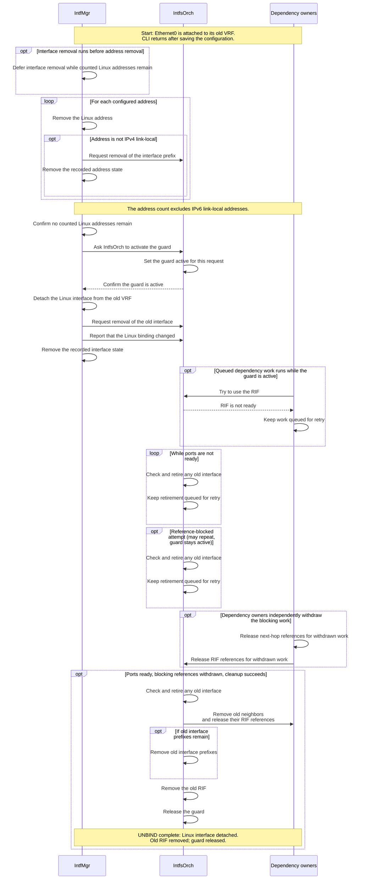
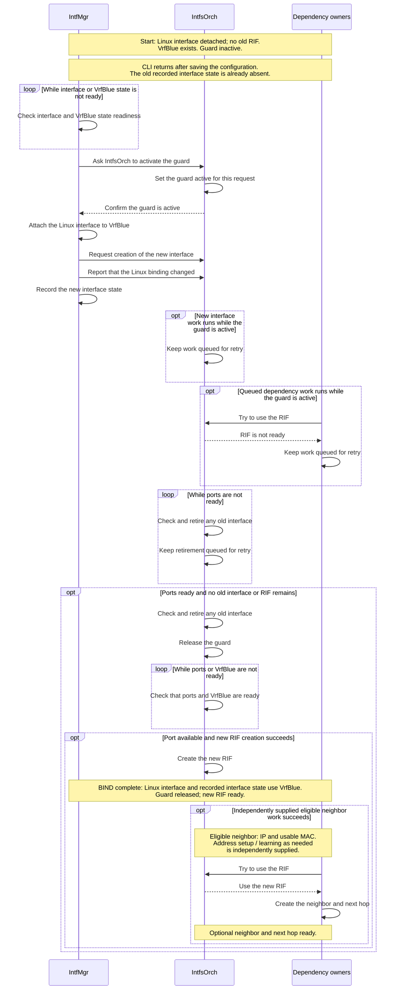
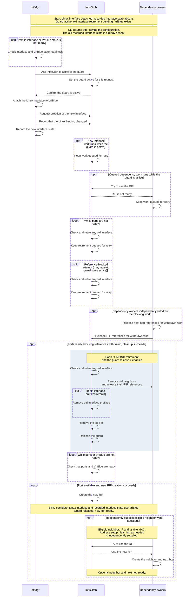

# SONiC VRF bind guard

## Revision history

| Rev | Date       | Author     | Change Description |
| --- | ---------- | ---------- | ------------------ |
| 0.1 | 2026-09-28 | Bojun-Feng | Initial draft. Describes the VRF bind guard and interface retirement approach. |

## Purpose

IntfMgr can change the Linux binding of an interface, that is, its attachment to a virtual routing and forwarding instance (VRF), while orchagent still owns the old router interface (RIF). New route or neighbor work can then use the old RIF and add references that keep the old RIF from being removed.

The VRF bind guard prevents new work from using the old RIF. IntfsOrch maintains one guard per interface alias. IntfMgr waits for IntfsOrch to confirm the guard is active before changing the Linux binding. While the guard is active, IntfsOrch retires the old interface, which removes its old neighbors, old interface prefixes, and old RIF. During this time, IntfsOrch keeps new interface work (interface-level and interface-prefix SETs) queued, and the dependency owners (RouteOrch, NeighOrch, and next-hop-group owners) keep dependency work queued. After retirement, IntfsOrch releases the guard. Ordinary processing can then create the new RIF, and the latest queued work can use it.

The design preserves the existing CLI and CONFIG_DB API. UNBIND (`config interface vrf unbind`) and BIND (`config interface vrf bind`) remain separate operations, and UNBIND can finish without a later BIND. Steady-state route leaking continues to use the existing route and next-hop model.

## Ownership and completion

The design keeps these objects separate:

- **Linux interface**: the Linux device for the interface. IntfMgr changes its VRF attachment, the Linux binding, with `master` (attach) or `nomaster` (detach).
- **Recorded interface state**: IntfMgr's interface-level STATE_DB entry, including its `vrf` field. Each address has separate recorded address state.
- **Interface prefixes**: the address entries that IntfMgr publishes to APPL_DB and IntfsOrch tracks. The interface-level APPL_DB entry is separate from its interface prefixes.
- **Old RIF / new RIF**: the orchagent RIF for the old interface configuration and the orchagent RIF for the new interface configuration.

| Owner | Responsibility |
| --- | --- |
| IntfMgr | Ask IntfsOrch to activate the guard, change the Linux binding, publish interface work to APPL_DB, and update recorded interface state. |
| IntfsOrch | Maintain the guard, retire the old interface, and create the new RIF. |
| Dependency owners | Check the guard before dependency work (routes, neighbors, next hops, and next-hop groups) uses a RIF. RouteOrch, NeighOrch, and next-hop-group owners keep their existing object references and retry responsibilities. NeighOrch removes old neighbors during retirement. |

CLI return, recorded interface state, and RIF readiness are separate completion points. The CLI returns after saving the configuration, that is, after its CONFIG_DB updates complete. IntfMgr updates recorded interface state after it changes the Linux binding, without waiting for old RIF removal. “UNBIND complete” and “BIND complete” mark the later point at which the Linux interface, the guard, and the RIF reach the state shown in each chart, not the CLI return.

“Old RIF removed”, “new RIF ready”, and “Optional neighbor and next hop ready” describe orchagent object state after successful Switch Abstraction Interface (SAI) API calls. These states do not show that traffic is forwarded; validation checks forwarding separately.

## Guard and retirement

IntfMgr asks for the guard through a request that has its own `request_id` (see [Request protocol](#request-protocol)). The guard enforces two ordering rules: IntfMgr changes the Linux binding only after IntfsOrch confirms that the guard is active, and IntfsOrch creates the new RIF only after it retires the old interface. IntfsOrch confirms by writing an acknowledgment whose `id` matches the current request and whose `state` is `guarded` or `retired`. This confirmation does not wait for retirement to finish.

While the guard is active, IntfsOrch keeps interface-level and interface-prefix SETs for the interface queued. Dependency owners check the guard before they create an object that depends on the RIF or reuse a cached one, including neighbors, next hops, and next-hop groups. When a dependency owner performs “Try to use the RIF” while the guard is active, IntfsOrch answers “RIF is not ready”, and the dependency owner must “Keep work queued for retry”. The guard blocks new references to the old RIF, not cleanup lookups. Cleanup and withdrawal paths can still find the old RIF and release existing references. Work that the guard blocks stays queued with the owner that retries it: the owner does not submit that work for hardware programming and does not count it as a successful entry in a bulk operation.

IntfsOrch retires the old interface with “Check and retire any old interface”. Each attempt first checks that all ports are ready, even when no old interface or RIF remains. If an old interface remains, IntfsOrch asks NeighOrch to “Remove old neighbors and release their RIF references”. IntfsOrch then performs “Remove old interface prefixes” for any interface prefixes that remain, any applicable proxy-ARP cleanup, and “Remove the old RIF”. Existing reference counts decide when each removal can finish: an object that other objects still reference cannot be removed yet. These blocking references come from dependency work, such as routes that use the old RIF. Dependency owners withdraw that work independently; as they do, they “Release next-hop references for withdrawn work” and “Release RIF references for withdrawn work”. BIND and UNBIND do not generate these withdrawals.

When a retirement attempt cannot finish, for example because ports are not ready or blocking references remain, IntfsOrch must “Keep retirement queued for retry”. The guard stays active until retirement completes and the current request permits IntfsOrch to “Release the guard” (see the `applied` and `cancel` actions in [Request protocol](#request-protocol)). If a cleanup step fails, the owner of that object handles the failure with its existing SAI error handling, including errors that it treats as terminal.

## Lifecycle examples

The three intent charts show the intended UNBIND and BIND lifecycles for Ethernet0; the BIND examples use the named VRF VrfBlue. Each chart shows one possible order of asynchronous steps. Consumers process published APPL_DB entries asynchronously, so other consumers can run between the steps shown. The charts show Linux operations and object changes only on their successful paths, and waits for readiness or for references to be released can repeat. A lifecycle reaches “UNBIND complete” or “BIND complete” only when the required readiness checks pass, blocking references are withdrawn, and cleanup or creation succeeds.

### UNBIND

`config interface vrf unbind Ethernet0` removes the interface configuration and the configured addresses. IntfMgr performs “Remove the Linux address” for each configured address. If interface removal runs before address removal, IntfMgr must “Defer interface removal while counted Linux addresses remain”; counted Linux addresses are all of the interface's Linux addresses except IPv6 link-local addresses. For each address that is not IPv4 link-local, IntfMgr also performs “Request removal of the interface prefix” and “Remove the recorded address state”. For an IPv4 link-local address, IntfMgr only removes the Linux address. IntfsOrch can process an interface-prefix removal before the guard is active or during retirement.

Once IntfMgr can “Confirm no counted Linux addresses remain”, it performs “Ask IntfsOrch to activate the guard”. After IntfsOrch replies “Confirm the guard is active”, IntfMgr performs “Detach the Linux interface from the old VRF”, then “Request removal of the old interface”, “Report that the Linux binding changed”, and “Remove the recorded interface state”. Before these last three steps, IntfMgr completes any applicable link-local neighbor cleanup; if that cleanup fails, interface removal stays pending. IntfsOrch completes retirement asynchronously, once ports are ready, blocking references are withdrawn, and cleanup succeeds. UNBIND does not need a target VRF or a later BIND to complete.

[UNBIND intent — full-size PNG](vrf-bind-guard/lifecycles/render/01-unbind-intent.png) · [SVG](vrf-bind-guard/lifecycles/render/01-unbind-intent.svg) · [Editable Mermaid](vrf-bind-guard/lifecycles/source/01-unbind-intent.mmd)

Mermaid source

For a sub-port, `config interface vrf unbind` removes the configured addresses and the old interface configuration, waits for the old recorded interface state to disappear, and then recreates the sub-port configuration without a VRF field, which places the sub-port in the default VRF. IntfsOrch must still retire the old interface before it creates the new RIF. The Ethernet0 UNBIND chart ends at “UNBIND complete” and does not show sub-port recreation or its final configuration.

### Clean BIND

A clean BIND starts with the Linux interface detached, recorded interface state absent, no old RIF, and the guard inactive. VrfBlue is the target VRF in the example. Before saving the new interface configuration, `config interface vrf bind Ethernet0 VrfBlue` removes the configured addresses and the old interface configuration, then waits for the old recorded interface state to disappear. It does not wait for old RIF removal. IntfMgr repeats “Check interface and VrfBlue state readiness” until both are ready, and then performs “Ask IntfsOrch to activate the guard”. After IntfsOrch replies “Confirm the guard is active”, IntfMgr performs “Attach the Linux interface to VrfBlue”, “Request creation of the new interface”, “Report that the Linux binding changed”, and “Record the new interface state”.

Even with no old interface, IntfsOrch must perform “Check and retire any old interface” before it can “Release the guard”: once all ports are ready, the attempt establishes that no old interface or RIF remains. IntfsOrch's ordinary interface processing then repeats “Check that ports and VrfBlue are ready” and, when the port is available and the SAI API calls succeed, performs “Create the new RIF”. New RIF creation is the “BIND complete” endpoint.

Neighbor work after BIND is optional and is supplied independently. BIND itself supplies neither replacement addresses nor neighbor work; address configuration and neighbor learning supply them as needed. For an eligible neighbor, which has a valid IP address and a usable MAC address, NeighOrch performs “Try to use the RIF”, IntfsOrch answers “Use the new RIF”, and, if processing succeeds, NeighOrch performs “Create the neighbor and next hop”.

[Clean BIND intent — full-size PNG](vrf-bind-guard/lifecycles/render/02-clean-bind-intent.png) · [SVG](vrf-bind-guard/lifecycles/render/02-clean-bind-intent.svg) · [Editable Mermaid](vrf-bind-guard/lifecycles/source/02-clean-bind-intent.mmd)

Mermaid source

### BIND while earlier UNBIND retirement is pending

This example starts after an earlier UNBIND has detached the Linux interface and removed the recorded interface state, while the guard is still active and old interface retirement is pending. When IntfMgr performs “Ask IntfsOrch to activate the guard” for the BIND, IntfsOrch performs “Set the guard active for this request”: the active guard transfers to the BIND's request and stays active, so no new work can use a RIF between the two requests. After IntfsOrch replies “Confirm the guard is active”, IntfMgr can “Attach the Linux interface to VrfBlue” and “Record the new interface state” while old interface retirement is still pending. New RIF creation and dependency work, not the Linux binding change or recorded interface state, wait for retirement.

When ports are ready, blocking references are withdrawn, and cleanup succeeds, the retirement attempt removes objects left by the earlier UNBIND: old neighbors, any remaining old interface prefixes, and the old RIF. IntfsOrch can then “Release the guard” for the BIND's request, which is the validated current request. The chart groups these steps as “Earlier UNBIND retirement and the guard release it enables”; the readiness waits and independent withdrawals before this group are its prerequisites. After guard release, new RIF creation and the optional neighbor work follow the same conditions as in clean BIND.

[BIND while earlier UNBIND retirement is pending — intent, full-size PNG](vrf-bind-guard/lifecycles/render/03-bind-waits-for-unbind-intent.png) · [SVG](vrf-bind-guard/lifecycles/render/03-bind-waits-for-unbind-intent.svg) · [Editable Mermaid](vrf-bind-guard/lifecycles/source/03-bind-waits-for-unbind-intent.mmd)

Mermaid source

## Request protocol

IntfMgr and IntfsOrch coordinate the guard through internal APPL_DB and STATE_DB tables. IntfMgr retains one current request per interface alias and allocates each new `request_id` from that retained record, so request IDs for an alias always increase. IntfMgr persists the request before it publishes the matching APPL_DB notification. Before IntfsOrch processes a notification, it validates the notification's ID and action against the retained request.

| Record | Writer and contents |
| --- | --- |
| APPL_DB `INTF_GUARD_TABLE:<alias>` | IntfMgr publishes `id` and `action`: `prepare`, `applied`, or `cancel`. |
| STATE_DB `INTERFACE_GUARD_TABLE\|<alias>` | IntfMgr writes `request_id`, `action`, `target_vrf`, `kernel_pending`, `applied_id`, and `applied_vrf`. IntfsOrch writes acknowledgment `id` and `state`, plus `retired_id` after retirement. |
| STATE_DB notification `INTF_GUARD_ACK` | IntfsOrch sends this notification to wake IntfMgr after writing the acknowledgment. IntfMgr reads the acknowledgment `id` and `state` from the retained record, not from the notification. |

The `action` values relate to the lifecycle operations as follows:

- **`prepare`** implements “Ask IntfsOrch to activate the guard”. IntfsOrch validates the request, performs “Set the guard active for this request”, and reports the guard state in its acknowledgment. IntfMgr proceeds only with a matching `guarded` or `retired` acknowledgment, which is the “Confirm the guard is active” step.
- **`applied`** implements “Report that the Linux binding changed”. Along with `applied`, IntfMgr publishes the ordinary interface work (“Request removal of the old interface” or “Request creation of the new interface”) and records `applied_id` and `applied_vrf`. `applied_vrf` records the applied request’s target VRF, or empty for `nomaster`. IntfsOrch then completes retirement and releases the guard for the current request.
- **`cancel`** ends a request whose `prepare` did not lead to a Linux binding change. If an earlier applied request still has unfinished retirement, that retirement must complete before IntfsOrch releases the guard.

The acknowledgment `state` shows progress: `guarded` means the guard is active; `retired` means old interface retirement has completed but the guard is still active; `released` means the guard is inactive. A replacement request is a new request that replaces the current request before the current request finishes, as in BIND while earlier UNBIND retirement is pending. IntfsOrch transfers the active guard to the replacement request without making the guard inactive, so no new work can use a RIF between the two requests. When a request finishes, its record is kept rather than deleted. IntfsOrch validates later notifications against this finished request record, so a stale APPL_DB notification cannot act on a new RIF.

`target_vrf` is the VRF for the Linux binding change of the current request: VrfBlue in the BIND examples, or empty for `nomaster`. `kernel_pending` marks unfinished Linux binding work. IntfMgr sets `kernel_pending` before it changes the Linux binding under the guard, and clears it after updating recorded interface state. If processing is interrupted or a replacement request arrives before IntfMgr clears `kernel_pending`, this field keeps the unfinished Linux binding work guarded. When IntfMgr retries the same `prepare`, it keeps the same `request_id`.

## Retained work and recovery

An applied request creates a retirement obligation: IntfsOrch must retire the old interface. The retirement obligation is retained separately from the ordinary interface queue. If an interface DEL and a later SET coalesce in that queue, `applied_id` still records the retirement obligation. IntfsOrch compares `applied_id` with `retired_id` to decide whether retirement is still pending, including after a newer `prepare` is canceled. Canceling that newer request therefore does not remove the earlier retirement obligation.

NeighOrch similarly keeps desired neighbor input separate from its hardware cache. Desired neighbor input is the neighbor SETs and DELs that NeighOrch receives. If NeighOrch previously consumed a desired SET for an old neighbor, it requeues that SET after it successfully removes the old neighbor, unless a newer SET or DEL for that neighbor is already pending. Desired SETs that are still pending stay queued while the guard is active. After IntfsOrch releases the guard and creates the new RIF, ordinary retries process the latest desired neighbor input.

During startup, IntfsOrch rebuilds active requests and finished request records from the retained request state, before dependency work can use a RIF. IntfMgr reconciles retained `prepare` requests and unfinished Linux binding work (`kernel_pending`) with the configuration and recorded interface state. IntfMgr resumes any retained removal before it processes a replacement request for a different VRF, and it recovers any applicable link-local neighbor cleanup from the old APPL_DB interface entry. IntfMgr can cancel an orphan prepare, which is a retained `prepare` with no removal obligation. This recovery scope assumes the retained request state is available.

`INTF_GUARD_ACK` makes IntfMgr retry its pending work. IntfMgr also retries on timeout and after other events, so pending work still makes progress if a notification is lost or if input arrives continuously.

## Compatibility and validation

The guard applies to non-loopback interface-level removal from a named VRF, to non-loopback interface-level creation attached to a named VRF, and to retained unfinished Linux binding work. Removing an interface that is already in the default VRF does not use the guard unless unfinished Linux binding work is retained for it. Loopback processing remains separate. Physical ports, VLAN interfaces, LAG interfaces, and sub-ports keep their existing manager and orchagent readiness requirements. IntfMgr still changes the Linux binding with `master` or `nomaster`.

Validation should compare behavior with the guard against the existing behavior and check each completion point separately:

- Exercise default-to-named, named-to-default, and named-to-named changes, independent UNBIND, cancellation, and overlapping BIND, in which the BIND's request is a replacement request, across the supported interface types and both address families, including addressless and link-local configurations.
- Verify that IntfMgr changes the Linux binding only after a matching guard confirmation, that old RIF removal precedes new RIF creation, and that guard-blocked work stays queued for retry. Cover direct routes, gateway routes, equal-cost multipath (ECMP), fine-grained ECMP, cached object reuse, and steady-state route leaking.
- Force DEL-to-SET coalescing, stale requests and acknowledgments, Linux command and SAI failures, both desired neighbor SET cases (a consumed SET that NeighOrch requeues after old neighbor removal, and a SET that is still pending while the guard is active), and supported reload/restart interleavings with retained state.
- Inspect Linux, FRRouting (FRR), APPL_DB, STATE_DB, ASIC_DB, object identity and reference counts, and forwarding separately. Check that IntfMgr still updates recorded interface state without waiting for old RIF removal, and that unrelated interfaces continue to progress.
