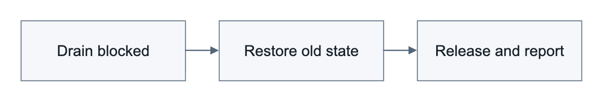

# SONiC VRF Rehome

## 1. Revision

| Version | Date | Author | Description |
|---|---|---|---|
| 1.0 | 2026-09-12 | Bojun-Feng | Define bounded interface rehome with an explicit terminal outcome. |
| 1.1 | 2026-09-12 | Bojun-Feng | Clarify requested binding, retry and deletion order, and qualification limits. |
| 1.2 | 2026-09-15 | Bojun-Feng | Limit the design to the rehome protocol. Remove promises for general kernel replay, address ownership across restart, and route-row replacement. Limit RIF replacement to an admitted apply or restore. |
| 1.3 | 2026-09-15 | Bojun-Feng | Qualify start-up cleanup. Withdraw only IntfMgr-published addresses. Other addresses still block deletion. |

## 2. Scope and vocabulary

Rehome changes the VRF binding of an existing CONFIG-managed interface. It includes a change to or from the default VRF. This design extends [SONiC virtual routing and forwarding (VRF) support](sonic-vrf-hld.md). Rehome of direct loopback interfaces and VNET-owned interfaces is out of scope. The design adds no route-leaking policy, new CLI, YANG, SAI API, daemon, container, or general transaction service.

A router interface (RIF) is the Switch Abstraction Interface (SAI) object that represents the interface in hardware. Its virtual-router association cannot change in place. An *admission fence* is IntfsOrch state that refuses new references to an interface. It continues to allow existing route, neighbor, and next-hop work to withdraw. CONFIG_DB records the requested binding. The applied binding is the IntfsOrch-acknowledged binding in STATE_DB. Writes to APP_DB outside the CONFIG_DB path are not rehome requests and keep their native behavior.

## 3. Problem and design contract

Changing only the Linux VRF master can leave Linux and the RIF in different VRFs. One reference-count check is not sufficient. Queued or retrying work can acquire a reference after the check. Rehome therefore uses the native single-RIF, break-before-make path. Traffic can be interrupted. The design does not delete a referenced RIF, promise a hitless rehome, force reference withdrawal, or use one earlier check as proof that RIF deletion is safe.

The [tracked ordering failure](https://github.com/sonic-net/sonic-buildimage/issues/28619) shows the consequence. A connected route can use the old RIF during a VRF change. Route state and interface state can then be inconsistent. This condition can prevent expected forwarding or local delivery. The earlier [connected-route guard](https://github.com/sonic-net/sonic-swss/pull/4645) covers removal that IntfsOrch already knows about. Route work can arrive before IntfsOrch has that information. IntfMgr must obtain admission before it changes the Linux VRF master. Retaining a request for retry does not prevent new references from blocking the request.

IntfMgr owns the request, checked Linux changes, phase budgets, and outcome. IntfsOrch owns admission, the RIF lifecycle, reference checks, and hardware acknowledgments. Route, neighbor, and next-hop components continue their normal withdrawals and retries. STATE_DB feedback from IntfsOrch wakes IntfMgr. The existing 1-second IntfMgr select timeout retries a pending request when no new event occurs. IntfsOrch feedback and acknowledgments advance a transition. Publication of an APP_DB command does not advance it.

## 4. Rehome behavior

### Successful rehome

1. Before a new request starts, IntfMgr waits for the parent and the requested VRF to be ready. It records the old and requested bindings. It sends a request ID and the IntfsOrch epoch. The old binding stays active. If recovery of an active request has started, loss of the requested VRF does not apply the readiness condition for a new request.
2. IntfsOrch admits the request and holds the admission fence. The admission fence covers acquisitions by queued and retrying work. Withdrawals continue. After IntfsOrch acknowledges admission, IntfMgr preserves IPv6 addresses across link-down and quiesces the interface. IntfsOrch reports the reference-drain phase ready only when references are zero and it still holds the admission fence.
3. IntfMgr changes the Linux VRF master with checked operations. It then asks IntfsOrch to apply the requested binding. IntfsOrch uses admitted RIF replacement only for a matching apply or restore. It removes the old RIF and creates the RIF for the requested binding through existing SAI operations. Any other VRF field on an APP_DB row keeps the native behavior: IntfsOrch ignores the field for an existing RIF. If RIF removal fails, IntfsOrch keeps the old RIF, its bookkeeping, and its counter registration. It retries the removal.
4. After IntfsOrch acknowledges the requested binding, IntfMgr restores the addresses and administrative intent from the current CONFIG row. IntfMgr records the acknowledged binding as the recovery binding before it requests release. IntfsOrch permits normal acquisition when it releases admission. IntfMgr publishes the terminal outcome only after both of these events: it receives the matching release acknowledgment, and it observes the acknowledged APP_DB row with empty control fields. APP_DB publication, zero references, or a Linux VRF master change alone is not a terminal outcome.

### Pre-application blockage and recovery

The 5-second reference-drain phase budget starts only after successful quiescence. The `prepare` and `release` phases each have a 10-second coordination phase budget. The `target` phase has a separate 10-second phase budget. A phase budget limits retry time. It is not a delay. Feedback can advance a ready phase immediately. A request that cannot progress stays queued. The 1-second IntfMgr select timeout retries it. The phase budgets do not limit traffic interruption, restoration time, or general daemon recovery time.

Persistent blockage before application of the requested binding cancels the request. The old RIF is retained or restored. IntfMgr restores the Linux VRF master. It then restores the addresses and administrative intent from the current CONFIG row before it publishes the `cancelled` outcome. If RIF teardown started, IntfsOrch must recreate or acknowledge the recovery RIF. Recoverable SAI failures keep the request nonterminal until recovery occurs. Empty control fields do not prove that restoration occurred.

An acknowledged binding recorded before release becomes the recovery binding. After release, recovery retains that binding. It does not delete new references to force a return to the old VRF. If the recovery binding is the requested binding, the request can therefore produce the `succeeded` outcome. Otherwise, STATE_DB reports the old binding as applied and the outcome as `cancelled`. Address restoration applies the addresses in the current CONFIG row through the native idempotent path. It withdraws addresses that IntfMgr published but that CONFIG_DB no longer contains. Address restoration applies only to the interface in transition. The design adds no address-ownership table and does not repair interfaces that are not in transition. IntfMgr logs address-command errors. It does not use these errors to determine the terminal outcome. Therefore, a terminal binding does not certify every address command, trailing attribute, or forwarding update.

### Current CONFIG row, deletion, and route support

A pending request reads the current CONFIG row on each retry, including withdrawals. It does not use the merged pending snapshot that a retained `SET` would contain. A current CONFIG row with no VRF field selects the default VRF. This rule also applies when the row supersedes a pending request. IntfMgr processes a newer VRF request after it reconciles the previous binding. Request IDs and IntfsOrch epochs prevent stale feedback from releasing admission for a newer request. CONFIG_DB retains the requested binding after cancellation. STATE_DB reports the applied binding and outcome. IntfMgr does not automatically start a request for the same cancelled binding. A separately processed request for a different binding retires the cancellation. This sequence includes a request for the applied binding before another request for the cancelled binding. The rule also applies to a cancelled request for the default VRF. Coalesced writes that IntfMgr has not processed do not establish the sequence.

A root `DEL` supersedes rehome. IntfMgr releases its temporary responsibility for the administrative-down state. It uses the current configured administrative intent, the native default when that intent is absent, or parent removal. Deletion in IntfsOrch releases admission without recreating the deleted IntfMgr status row. Ordinary RIF deletion still waits for native references and has no rehome timeout. A `DEL` followed by a `SET` uses the native deletion policy, not the in-place rehome phase budget. A newer `SET` waits while a `DEL` is pending. Withdrawals continue. A failed restore is reported and is not retried. The interface row is already absent, and its device can also be in removal.

In an immediate address-`DEL`, root-`DEL`, root-`SET`, address-`SET` batch, the root and address `SET` operations wait while the root `DEL` is pending. Address withdrawals continue. If consumer coalescing hides the `DEL`, cleanup can retire only obsolete admission after the control fields and IntfMgr status row are absent. Cleanup must not retire a live newer request. When deletion supersedes recovery of a missing RIF, cleanup clears both obsolete admission markers. A RIF that is still present keeps its native deletion fence.

Legitimate cross-VRF forwarding remains valid; route-VRF equality with the RIF VRF is not an admission rule.

### Interaction with other publishers

Admission controls when components can acquire references. It does not replace obsolete fields in a route row. Full-row field replacement during Forwarding Plane Manager (FPM) route updates and warm restoration is a separate correctness concern. It is not part of this design. Both Multiprotocol Label Switching (MPLS) acquisition call sites retain deferred retry work when labeled-next-hop creation is delayed.

A static anycast gateway (SAG) MAC update republishes the raw CONFIG_DB row of each SAG-enabled VLAN interface. This update is outside the rehome protocol. An APP_DB producer write merges into the row instead of replacing it. During a transition, the SAG update omits the VRF field. The requested binding therefore cannot replace the phase-specific binding that IntfMgr published. The SAG update also does not raise a link that the transition holds down. Outside a transition, SAG keeps its native behavior. This behavior includes republishing a requested binding that is not applied. IntfsOrch ignores that VRF field for an existing RIF.

## 5. Operational state and existing interfaces

CONFIG_DB continues to show the requested binding. `INTERFACE_REHOME_TABLE` shows the acknowledged applied binding, phase, reference count, and outcome. A cancelled requested binding can remain in CONFIG_DB while the old binding is applied. Existing readiness state updates its applied VRF only after reconciliation and release acknowledgment.

For example, an interface requests rehome from `VrfBlue` to `VrfRed`. An existing reference prevents the reference-drain phase from completing. After cancellation, CONFIG_DB still requests `VrfRed`. STATE_DB reports `applied_vrf=VrfBlue` and `outcome=cancelled`. This is an acknowledged cancellation. It is not successful rehome to the requested binding.

| Store and key | Internal fields and role |
|---|---|
| APP_DB `INTF_TABLE`, interface key | `rehome_id`, `rehome_phase`, `rehome_target`, `rehome_epoch`, and phase-specific `vrf_name` during a transition; native `vrf_name` publication otherwise. Each publication derived from CONFIG_DB sets the control fields to empty values. A producer write that omits them merges into the row and does not remove them. |
| STATE_DB `INTERFACE_REHOME_TABLE`, interface key: IntfMgr fields | `manager_id`, `manager_old_vrf`, `manager_target`, `manager_phase`, `phase_budget_seconds`, `manager_owner_epoch`, `manager_recovery_vrf`. |
| Same row: IntfsOrch and outcome fields | `owner_id`, `owner_epoch`, `owner_phase`, `old_vrf`, `requested_vrf`, `applied_vrf`, `rif_id`, `ref_count`, `outcome` (`pending`, `recovering`, `succeeded`, or `cancelled`), and terminal `manager_applied_vrf`. |
| STATE_DB `INTERFACE_REHOME_TABLE`, `__owner__` key | IntfsOrch-written `epoch` for restart detection. |

IntfMgr and IntfsOrch fields are meaningful only when their request IDs and epochs match. The shared row is not an atomic configuration transaction. The APP_DB control fields are part of the internal rehome protocol. They are not another configuration API.

## 6. Restart, warm/fast boot, serviceability, and limits

After an IntfMgr restart, native CONFIG replay resumes the recorded nonterminal request. IntfMgr reestablishes admission and recovers the recorded recovery binding. If the restart interrupts the `clearing` phase, IntfMgr resumes control-field cleanup without quiescing the applied interface again.

If the CONFIG_DB row of a nonterminal status row was withdrawn while IntfMgr was down, start-up replay first withdraws IntfMgr-published addresses that CONFIG_DB no longer contains. It then starts the root `DEL`. The native deletion conditions still apply. IntfMgr does not remove an address that it did not publish, such as an IPv4 link-local address or an address added by another component. Such an address still blocks deletion, as it does during ordinary interface deletion. A subscriber replays only live rows. It does not replay a deletion that occurred while the subscriber was down.

An IntfsOrch restart changes the IntfsOrch epoch and invalidates old acknowledgments. IntfMgr then cancels the transition and starts recovery. This process does not repair the kernel state of interfaces that are not in transition. A SWSS restart uses native CONFIG replay. IntfMgr does not change a released binding back to the old binding only because terminal publication was interrupted. Orchagent refuses a planned warm restart while a transition is nonterminal.

The admission fence is per interface. Progress is event driven. The design does not scan ordinary routes and does not add an unconditional delay to interface creation or unrelated route work. It adds no boot-critical delay or third-party dependency. State consists of each active transition and retained status rows. It is not a cross-subsystem dependency graph. A later request replaces a terminal status row. Interface deletion removes the status row.

Transition warnings identify the interface, old and requested bindings, phase, elapsed time, and phase budget. A kernel-command failure during a transition is retried within the phase budget. If the failure persists, IntfMgr cancels the request. Outside a transition, kernel commands keep their native log-and-continue behavior. Aggregate references are unattributed unless existing component state identifies their source. This design adds no reference inventory. Existing IPv6 `keep_addr_on_down` persists after rehome. Quiescing a parent can affect subinterfaces. A recreated RIF can briefly have default MAC, MPLS, NAT, or loopback attributes until the final full `SET` derived from the current CONFIG row arrives. A subinterface keeps its sub port and host interface during rehome. If the RIF for the requested binding cannot be created, the sub port outlives its interface until root deletion reclaims it.

The parent, required VRFs, and routing services must remain available for the request to finish. The design does not establish target-ASIC platform recovery, LAG/VLAN/subinterface lifetime and restart behavior, whole-switch or hitless warm/fast reboot, outage duration, ZMQ behavior, or scale guarantees. Permanent hardware failure leaves the status row nonterminal. It does not claim restored forwarding. Forwarding converges through normal route and neighbor processing after release, not at RIF acknowledgment.

## 7. Verification and open qualification

### Unit coverage requirements

* Correlate request IDs and IntfsOrch epochs. Reject stale feedback. Refuse queued acquisitions while allowing ordinary withdrawals.
* Reconcile the current CONFIG row. Restore its addresses and administrative intent.
* Exercise RIF failures, compensation, retries, and deletion/recreation ordering.
* Confirm that IntfMgr publishes a terminal outcome only after IntfsOrch consumes the empty control fields. Confirm that a SAG publication cannot replace a transition binding or raise a link that the transition holds down.

### System qualification requirements

* Rehome IPv4 and IPv6 routed Ethernet interfaces between the default VRF and named VRFs. Check CONFIG_DB, Linux, APP_DB, STATE_DB, ASIC_DB, and forwarding after release.
* Exercise transient and persistent blockers, current address and route changes, superseding requests, and deletion/recreation.
* Inject recoverable RIF failures and IntfMgr or IntfsOrch interruptions at recovery boundaries, including release before terminal publication.
* Check unrelated interfaces and ordinary deletion as controls.

### Open qualification

These items are test requirements. They do not state that every platform, interface type, or interruption schedule passed. Recovery from arbitrary kernel address-command failure is not established. The following items remain unqualified: real-Redis restart integration, actual daemon respawn, `OrchDaemon::init()` paths, target-ASIC SAI failure handling, and forwarding recovery. Native component tests do not establish hardware-specific timing or warm/fast-reboot outage behavior. A focused in-process fake qualifies the order between publication and consumption of empty control fields. The fake covers producer staging and merge operations. It uses no Redis, Lua script, or separate process. It is not evidence for those environments.
